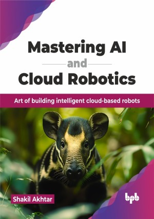

# Mastering AI and Cloud Robotics

Art of building intelligent cloud-based robots.

This is the repository for [Mastering AI and Cloud Robotics
](https://bpbonline.com/products/mastering-ai-and-cloud-robotics?variant=44195196600520),published by BPB Publications.

## About the Book
This book teaches theory and coding examples to help readers design AI-powered cloud robotics applications. AI and robotics engineers will learn to build scalable systems, apply various methods for monitoring and prediction, and optimize systems to reduce costs and increase performance using the architectural techniques described.

This book offers a detailed look into cloud robotics, starting with cloud computing basics and moving into its applications in robotics. It highlights the role of AI, ML, and computer vision in advancing robotic capabilities. This book also covers cloud robotics infrastructure, focusing on communication protocols and the ROS2 framework. Further, you will learn about building cloud-enabled robots and using AWS for AI and robotics. It addresses data privacy and security, concluding with real-world applications across various industries and insights into the future of cloud robotics.

This book equips you with the foundational knowledge and practical skills to leverage the power of cloud computing to enhance the capabilities of robotic systems. You will gain the ability to design, develop, deploy, and manage cloud-enabled robots, pushing the boundaries of automation and innovation across various industries. 

## What You Will Learn
• Understand cloud computing concepts, including service models, deployment models, and security.

• Explore cloud robotics history, benefits, and AI integration in robotic systems.

• Learn AI algorithms, ML, and deep learning for robotics applications.

• Gain skills in computer vision, object detection, and enhancing robot perception using AI.

• Master Robot Operating System 2 (ROS2) architecture and build cloud-enabled robots with hands-on experience.
